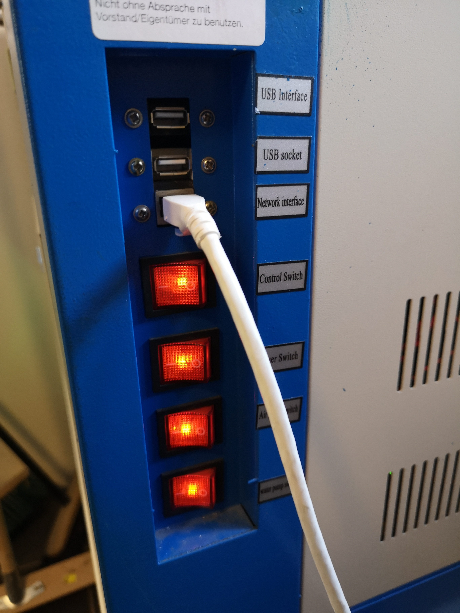
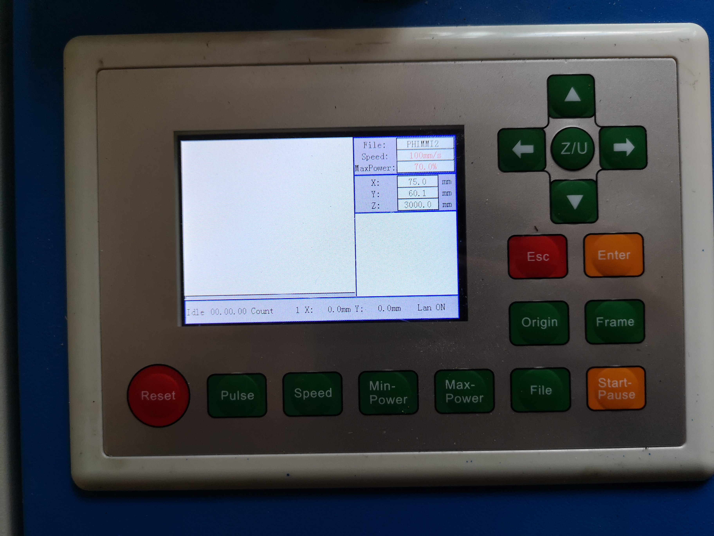
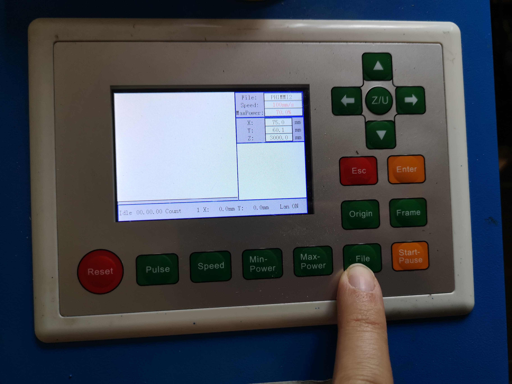
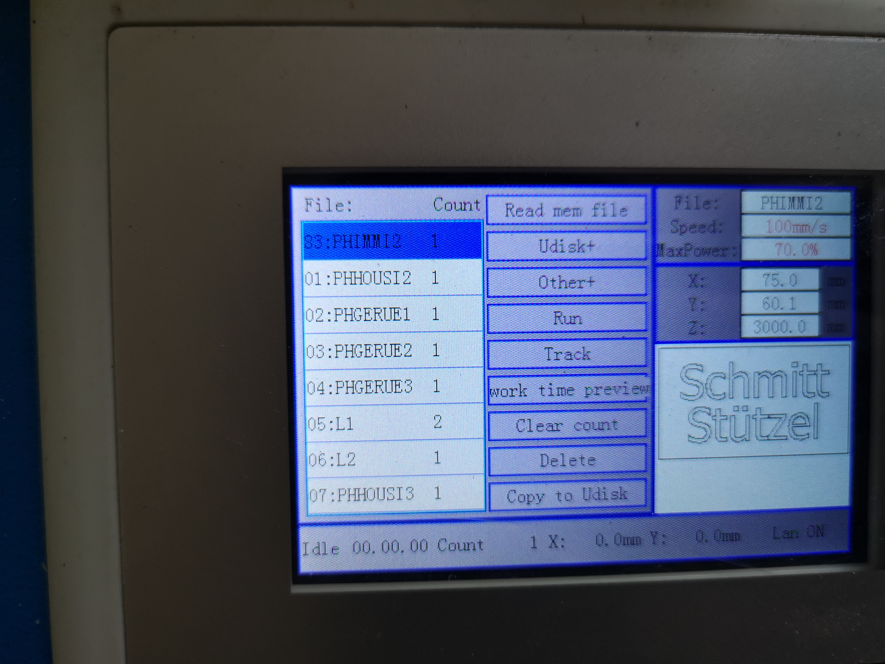
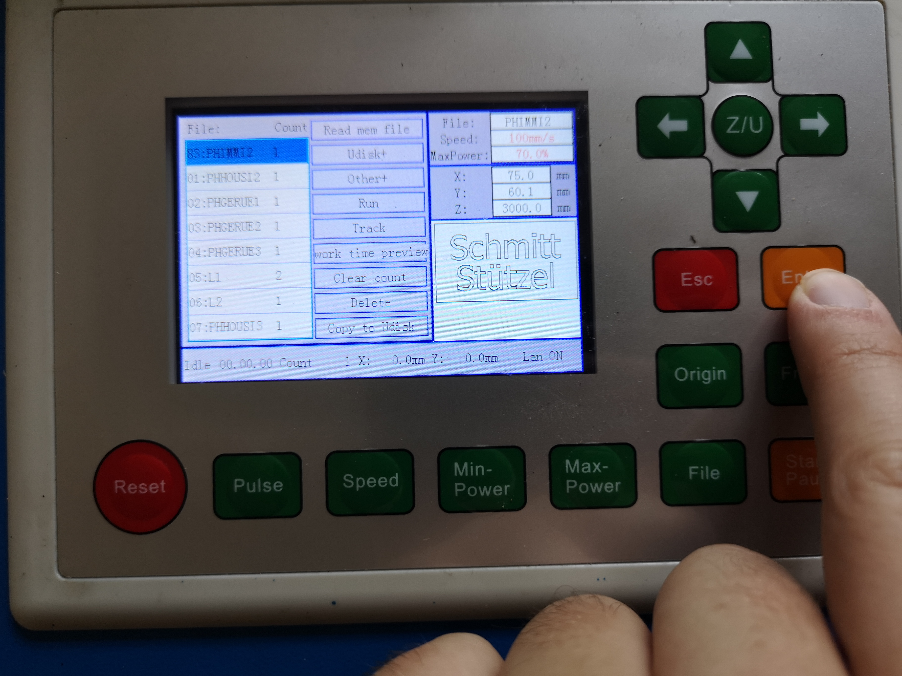
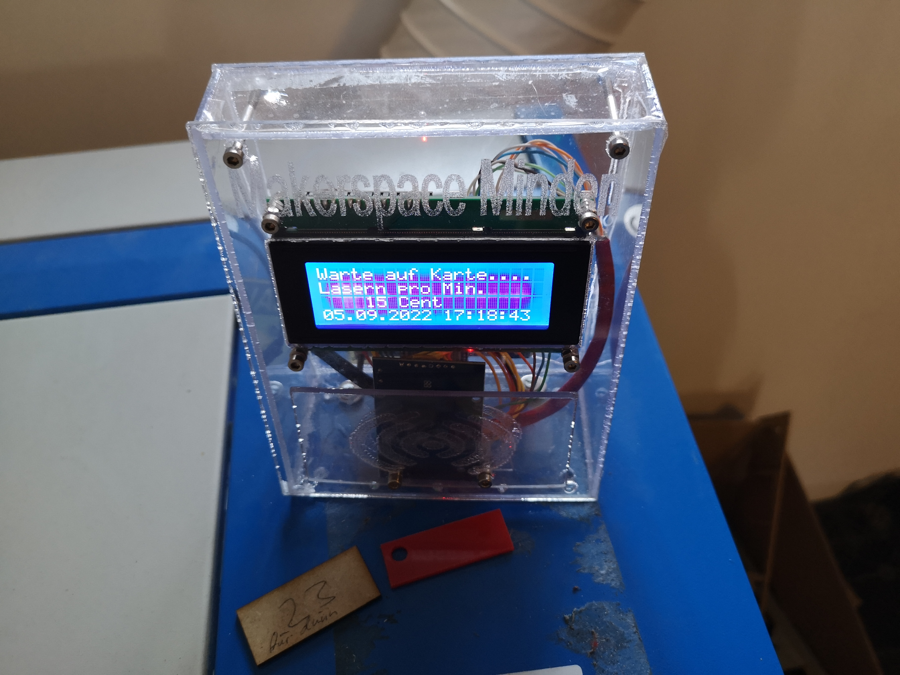

# Lasercutter
- Typ: `K40`
- Leistung: 40 Watt
- Art: CO2 Laser
## Disclaimer
Benutzung auf eigene Gefahr! Bitte beachtet die Sicherheitshinweise des Herstellers und fragt im MakerSpace nach, wenn Ihr Euch unsicher seid. Ein Laser ist ein gefährliches Gerät und sollte nur mit größter Vorsicht benutzt werden.
## Programme
Unser Lasercutter arbeitet mit RD-Dateien. Diese müssen über ein spezielles [Konstruktionsprogramm](##Programme) erstellt werden.
Diese RD-Datei kann dann über die entsprechenden Programme auf den Laser hochgeladen werden.
Hierzu muss unser Lasercutter in den Programmen eingerichtet werden. Der Laser wird mit einem DSP der Firma `Ruida` angesteuert. Der Laser hat die interne IP-Adresse `192.168.41.25`.
Die Programme werden wie typische Zeichenprogramme bedient, nur dass eben zum Schluss ein anderes Dateiformat rauskommt.
### LightBurn
LightBurn ist ein Konstruktionsprogramm zur Bedienung von Lasercuttern unter Windows. [LightBurn](https://lightburnsoftware.com/collections/frontpage/products/lightburn-dsp) ist kostenpflichtig. Die passende Lizenz für DSP-Bedienung kostet zirka 120€. Der MakerSpace hat die Lizenz erworben und auf dem Packard Bell im MakerSpace kann es benutzt werden.
### RDWorks
RDWorks ist die Originalsoftware des Herstellers und kostenfrei, hat jedoch viele Funktionen nicht und ist sehr umständlich in der Bedienung. Es eignet sich für einfache Formen.

## Manuelle Bedienung am Laser
- Lasercutter am Seitenpanel einschalten. Es wird laut und das Hauptmenü erscheint auf dem Display.
- Unbedingt den Abluftschlauch aus dem Fenster hängen
 

- Man wählt über den Knopf "File" und die Hoch/Runter und Enter-Taste die zuvor hochgeladene Datei aus
 

- Mit dem Knopf "Origin" gelangt man zum Startpunkt (0,0) des zu lasernden Objektes
- Der Knopf "Frame" sorgt dafür, dass der gesamte Frame-Umfang des Objektes abgefahren wird
 

- Kontrolliere anhand des "Frame", dass das Werkstück korrekt im Laser liegt. (siehe dazu Video in `./img/Lasercutter_Frame_Movement.mp4`)
- Bezahlvorgang mit MakerSpace Karte
Der Laser verbraucht viel Strom und die Wartungs- und Ersatzteilkosten sind sehr hoch, weshalb wir einen Beitrag von 15ct pro Minute erheben. Dieser wird von deiner MakerSpace Karte direkt eingezogen. Bitte lege deine Karte auf das auf dem Laser befindliche Bezahlterminal und starte dann den Laservorgang.
 

## Tipps & Tricks
- Es bietet sich an für gerade Kanten, dass man bereits im Konstruktionsprogramm einen Rahmen um das gewünschte Objekt zieht, sodass man anhand dessen komplexere Figuren ausrichten kann und stets ein gerades Ergebnis herauskommt.
## TL;DR Anleitung
- Konstruktionsdateien mit Software erstellen
- RD-File auf Lasers hochladen
- Manuelle Bedienung am Gerät und Bezahlung

